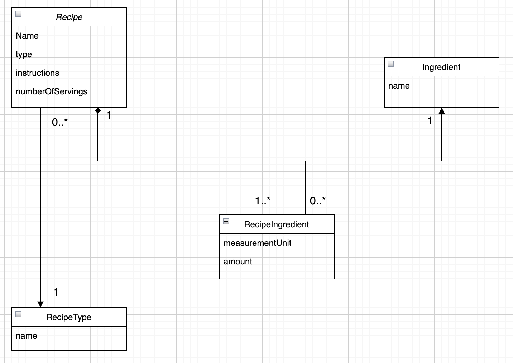

# Recipes Application

A task of searching for Recipes and its Ingredients

### Application Architecture

This application built using N-Tier Architecture.
The application depends on Three main layers:

- The Presentation tier which contains the REST Endpoints  (Resource Directory)
- The Logic Tier which has all business validation (Service Directory)
- The Data Tier which responsible for dealing with the Database (Repository Directory)

### UML and Entities

- The Recipe Entity : A model for the Recipe:

    - name
    - type
    - instructions
    - numberOfServings
    - ingredients

- The Recipe Type Entity : A model for the Recipe Type:

    - name (like VEGETARIAN, NON_VEGETARIAN, or VEGAN)

- The Ingredients Entity : A model for the Ingredients:

    - unit : the unit used for that ingredient (like MILLIGRAM, LITER, TEASPOON, GALLON, etc..)

- The Recipe Ingredients Entity : the entity links between the Recipe and its Ingredients as the relationship between
  the Recipe to Ingredients is many-to-many relationship

    - recipe
    - amount

### Used Technologies and Frameworks:

- Docker
- Spring Boot
- Spring Specifications for searching for Recipes
- Swagger UI
- Mysql Database
- H2 Database on local environment
- Liquibase
- Junit for Unit Test
- Spring Integration Test and Parameterized test cases (covers more than 80% of the application, and I'm interested to make it 100%)

### How to start the app

All you need is:

1- packaging the application (just for the first time, No need to do it again if you are restarting the appication)

`./mvnw package`

2- run docker-compose command

`docker-compose up -d`

then open the Swagger documentation page

localhost:8080/

You can track the application logs by removing the detached flag (`-d`) to the command

`docker-compose up`

To stop the container all you need it running

`docker-compose down`

### Notes

- It could take some time on running the application for the first time, as Docker will download some needed resources
  image
- The application use docker volume, so don't care about losing your data on stopping the containers
- If you need to clear up your database and start it fresh as beginning with the seed data, Just use `docker-compose down -v`
- To run the Test cases, just use `./mvnw integration-test`
- The Application uses Spring Specifications, So you can Search for Recipes using the combination of:
    - name (`equals`, `notEquals`, or `contains`)
    - instructions (`equals`, `notEquals`, or `contains`)
    - numberOfServings (`equals`, or `notEquals`)
    - recipeTypeId (`equals`, or `notEquals`)
    - recipeTypeName (`equals`, `notEquals`, or `contains`)
    - ingredientId (`equals`, or `notEquals`)
    - ingredientName (`equals`, `notEquals`, or `contains`)

HINT : The combination works among these fields not among the criteria on the same field, So don't use the same field twice with different criteria (like using `name.contains` and `name.equals` at the same time).

Example for a valid Search Criteria -> `name.contains=meatBall&recipeTypeName.notEquals=VEGETARIAN`

Example for an invalid Search Criteria -> `name.contains=meatBall&name.notEquals=chicken`
